# AttendQR database ER diagram

This diagram reflects the academic-year and semester relationships in the current schema. Legacy-compatible nullable columns remain nullable so migration `007_academic_year_semester_subjects.sql` can preserve unresolved historical records without guessing their semester.

```mermaid
erDiagram
    USERS ||--o| STUDENTS : "has student profile"
    USERS ||--o| TEACHERS : "has teacher profile"
    ACADEMIC_YEARS ||--|{ SEMESTERS : contains
    ACADEMIC_YEARS ||--o{ CLASSES : contains
    SEMESTERS ||--o{ SUBJECTS : offers
    SEMESTERS ||--o{ STUDENTS : enrolls
    CLASSES ||--o{ STUDENTS : groups
    TEACHERS ||--o{ TEACHER_TERMS : teaches_in
    SEMESTERS ||--o{ TEACHER_TERMS : defines
    CLASSES ||--o{ TEACHER_TERMS : targets
    TEACHER_TERMS ||--o{ TEACHER_SUBJECTS : includes
    TEACHERS ||--o{ TEACHER_SUBJECTS : receives
    SUBJECTS ||--o{ TEACHER_SUBJECTS : assigned_as
    TEACHERS ||--o{ ATTENDANCE_SESSIONS : creates
    SUBJECTS ||--o{ ATTENDANCE_SESSIONS : identifies
    TEACHER_SUBJECTS ||--o{ ATTENDANCE_SESSIONS : authorizes
    ATTENDANCE_SESSIONS ||--o{ QR_CODES : publishes
    ATTENDANCE_SESSIONS ||--o{ ATTENDANCE : records
    STUDENTS ||--o{ ATTENDANCE : submits

    USERS {
        int id PK
        varchar username UK
        varchar full_name
        enum role
        enum status
    }
    STUDENTS {
        int id PK
        int user_id FK
        varchar student_no UK
        int class_id FK
        tinyint year_level
        smallint semester_id FK
    }
    TEACHERS {
        int id PK
        int user_id FK
        varchar staff_no UK
    }
    ACADEMIC_YEARS {
        tinyint id PK
        tinyint year_level UK
        varchar name UK
    }
    SEMESTERS {
        smallint id PK
        tinyint academic_year_id FK
        tinyint semester_number
        varchar name
    }
    CLASSES {
        int id PK
        tinyint academic_year_id FK
        varchar name UK
    }
    SUBJECTS {
        int id PK
        varchar code
        varchar name
        smallint semester_id FK
    }
    TEACHER_TERMS {
        int id PK
        int teacher_id FK
        smallint semester_id FK
        int class_id FK
    }
    TEACHER_SUBJECTS {
        int id PK
        int teacher_id FK
        int teacher_term_id FK
        int subject_id FK
    }
    ATTENDANCE_SESSIONS {
        int id PK
        int teacher_id FK
        int subject_id FK
        int teacher_subject_id FK
        datetime starts_at
        datetime ended_at
    }
    QR_CODES {
        int id PK
        int session_id FK
        varchar token_hash UK
        boolean active
    }
    ATTENDANCE {
        int id PK
        int session_id FK
        int student_id FK
        enum status
        timestamp recorded_at
    }
```

